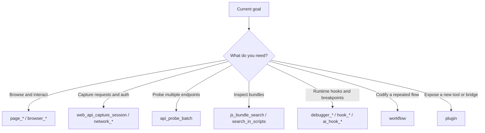

# Tool Selection

## The short version

- **Use built-in tools first, extensions second**
- **Prefer workflows before plugins**
- **Parallelism is great for reads, bad for shared page-state mutation**

## Decision tree

## Parallelism rules

### Good candidates for parallel reads

- `page_get_local_storage`
- `page_get_cookies`
- `network_get_requests`
- `console_get_logs`
- `extensions_list`

### Bad candidates for parallel state changes

- `page_click` + `page_type`
- login + CAPTCHA
- multiple navigation-triggering actions

## Subagent rules

### Good sidecar tasks

- bundle reading
- request inventory cleanup
- HAR/report drafting
- extension template documentation

### Keep these local to the main agent

- real-time browser manipulation
- login-state-sensitive steps
- CAPTCHA handling
- tightly ordered interactions
