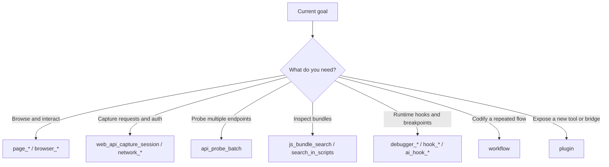

# Tool Selection

## The short version

- **Use built-in tools first, extensions second**
- **Prefer workflows before plugins**
- **Parallelism is great for reads, bad for shared page-state mutation**

## Decision tree



## Search Base And Escalation Rules

- There are **three total tiers**: `search / workflow / full`
- `search` is the default base tier, not an auto-escalation tier.
- `workflow` and `full` are the opt-in upgrade tiers.
- `search_tools` only searches and ranks results. It does **not** auto-run `activate_tools`, and it does **not** auto-run `boost_profile`.
- Preferred chain: `search_tools -> activate_tools / activate_domain -> boost_profile only when really needed`
- If you only need a few exact tools, prefer `activate_tools`. Do **not** boost to `workflow / full` just to access one or two named tools.
- `boost_profile` is for stages where you expect to use a broad family of related tools repeatedly, not for a mandatory follow-up after every search.

## Best-Practice Prompts

These prompts work well as persistent MCP-client instructions for `jshook`.
This section contains **3 tier prompts**: `search / workflow / full`.

### `search` Tier Prompt

```text
You are running on jshook's default search tier. When a capability is unfamiliar, missing from the visible tool list, or you are unsure of the exact tool name, do not say it is unavailable before searching. Call search_tools first, then prefer activate_tools for exact matches or activate_domain for a whole domain. Only call boost_profile when you expect to use a broad group of related tools repeatedly, usually to enter workflow or full.
```

### `workflow` Tier Prompt

```text
If the task involves sustained page interaction, request capture, auth extraction, batch API probing, streaming, debugger / network coordination, or repeated business flows, search first and inspect the candidates. Boost to workflow only when browser, network, debugger, workflow, or related tool families will be used repeatedly; if only one or two tools are needed, prefer activate_tools instead of a mechanical tier boost.
```

### `full` Tier Prompt

```text
Boost to full only when the task clearly needs heavyweight reverse-analysis capabilities such as hook, process, wasm, antidebug, platform, sourcemap, or transform tooling, or when a long combined debugging phase is expected. Once in full, finish that heavy phase in a concentrated pass, then unboost_profile or let TTL downgrade the session automatically to avoid prolonged high context cost.
```

## Parallelism rules

### Good candidates for parallel reads

- `page_get_local_storage`
- `page_get_cookies`
- `network_get_requests`
- `console_get_logs`
- `extensions_list`

### Bad candidates for parallel state changes

- `page_click` + `page_type`
- login + CAPTCHA
- multiple navigation-triggering actions

## Subagent rules

### Good sidecar tasks

- bundle reading
- request inventory cleanup
- HAR/report drafting
- extension template documentation

### Keep these local to the main agent

- real-time browser manipulation
- login-state-sensitive steps
- CAPTCHA handling
- tightly ordered interactions
