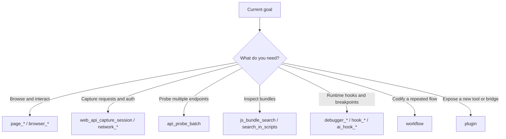

# Tool Selection

## Core Principle: Use route_tool, Don't Stack Meta-Tools

**Wrong** — manually chaining meta-tools:

```text
search_tools → describe_tool → activate_tools → call tool   ← wastes 4 context rounds
```

**Right** — one-step workflow:

```text
route_tool(task="intercept this page's API requests")   ← auto-recommend + activate + examples
```

`route_tool` automatically handles: task intent analysis → workflow pattern matching → domain-level activation (with TTL) → returns recommended tool chain with argument examples. **One `route_tool` call is enough for most scenarios.**

## Decision Tree



> **Note:** Tool names above are for decision guidance only. Always use `route_tool` to get exact tool names and arguments.

## Three-Phase Workflow: Discover → Activate → Use

```text
1. DISCOVER  →  route_tool(task="describe your intent")   — preferred, task-driven, auto-recommend + activate
                search_tools(query="keywords")             — fallback, keyword exploration
2. ACTIVATE  →  Usually already done by route_tool. Manual activation only for:
                activate_domain(domain="network")          — when you need an entire domain
                activate_tools(names=[...])                — pinpoint a few specific tools
3. USE       →  Call activated tools directly
                call_tool(name, args)                      — fallback when tools don't appear in list
```

## Profiles and Baseline Tool Sets

Configured via the `MCP_TOOL_PROFILE` environment variable. Hierarchy: **search ⊂ workflow ⊂ full**

| Profile                      | Domains | Includes                                                                           | Use Case                                             |
| ---------------------------- | ------- | ---------------------------------------------------------------------------------- | ---------------------------------------------------- |
| `search` (default)           | 1       | maintenance (meta-tools only)                                                      | On-demand discovery, minimal context                 |
| **`workflow` (recommended)** | **9**   | **+ analysis, browser, debugger, encoding, graphql, network, streaming, workflow** | **E2E reverse engineering, daily security research** |
| `full`                       | 16      | + antidebug, hooks, platform, process, sourcemap, transform, wasm                  | All tools, for complex debugging                     |

> **Recommendation:** Set `MCP_TOOL_PROFILE=workflow` for daily use to avoid frequent discover-activate overhead.

### Recommended Usage Per Profile

**`search` tier:**
When a capability is unfamiliar or missing from the visible tool list, don't say it's unavailable. Call `route_tool` with your task intent and let the server recommend and auto-activate. Use `search_tools` for more precise keyword-based exploration.

**`workflow` tier:**
Core domains (browser, network, debugger, workflow, etc.) are preloaded. Most reverse engineering tasks can start immediately without extra activation. Only `activate_domain` manually for heavyweight capabilities like hooks/process/wasm.

**`full` tier:**
All 238 tools are preloaded. No activation needed. Best for extended combined debugging sessions. Be aware of higher context overhead.

## Key Rules

- **Always start with `route_tool`**: Describe your task intent, let jshook recommend the tool chain and execution order — don't guess tool names
- **`search_tools` is for exploration only**: Use when you're unsure what tools exist
- **`describe_tool` works for all tools**: Including meta-tools themselves (search_tools, activate_domain, call_tool, etc.)
- **`call_tool` is the universal fallback**: When tools are activated but don't appear in your tool list (MCP client doesn't support `tools/list_changed`), use `call_tool` to invoke by name
- **Auto-activation has TTL**: Automatic activations triggered by `search_tools` / `route_tool` default to 30-minute timeout, then auto-cleanup

## SPA Reverse Engineering Notes

- Fetch/XHR interceptors support `persistent: true` mode — injected once, they survive navigations (no ordering constraint with `page_navigate`)
- Check `localStorage` first — JWT/tokens may already be there, no packet capture needed
- Include OpenAPI endpoints (`/docs`, `/openapi.json`) in `api_probe_batch` first batch
- `web_api_capture_session` auto-exports `.har` to disk, recoverable from file after context compression
- Downgrade after diagnosis: stop using heavy debugger/hook tools once root cause is identified

## Parallelism Rules

### Good candidates for parallel reads

- `page_get_local_storage`
- `page_get_cookies`
- `network_get_requests`
- `console_get_logs`
- `extensions_list`

### Bad candidates for parallel state changes

- `page_click` + `page_type`
- login + CAPTCHA
- multiple navigation-triggering actions

## Subagent Rules

### Good sidecar tasks

- Bundle source analysis and comprehension
- Request inventory filtering and cleanup
- HAR analysis and report drafting
- Extension template documentation

### Keep these local to the main agent

- Real-time browser manipulation
- Login-state-sensitive steps
- CAPTCHA handling
- Tightly ordered interactions
