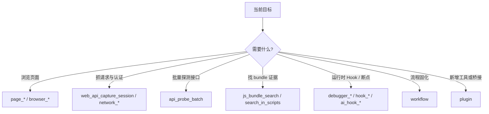

# 工具选择

## 一句话判断

- **先 built-in，后扩展**
- **先 workflow，后 plugin**
- **并行适合读，不适合改共享页面状态**

## 决策树

## 并行原则

### 适合并行

- `page_get_local_storage`
- `page_get_cookies`
- `network_get_requests`
- `console_get_logs`
- `extensions_list`

### 不适合并行

- `page_click` + `page_type`
- 登录 + 验证码
- 多个可能触发跳转的动作

## subagent 使用原则

### 适合丢给 subagent

- bundle 阅读
- 请求清单整理
- HAR / 报告草稿
- 扩展模板说明文档

### 应保留在主 agent

- 浏览器实时操控
- 登录态步骤
- CAPTCHA
- 强顺序依赖动作
